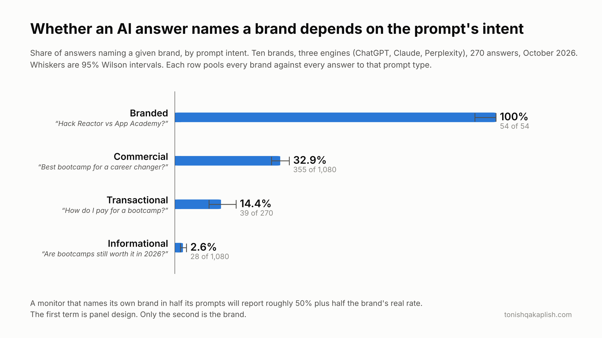

# 61% visible. 39 points of it were the prompt list.

*I built an AI visibility monitor for a coding bootcamp. It reported the brand in 61% of AI answers about its category. Then I measured how much of that number was the monitor, re-ran the question across ten brands and three engines, and threw out five findings on the way. This is what held.*

Tonishqa Kaplish · October 2026 · [Interactive version](https://ai-visibility-audit-rho.vercel.app/study/) · [Code and data](https://github.com/tkaplish888-alt/ai-visibility-audit)

---

## The short version

When a prompt names a brand, the answer names the brand. In this study, 54 of 54 times across three engines. In the monitor that started all this, 482 of 482 times across six weekly runs. No exceptions in either dataset.

That one fact turns an "AI visibility score" into arithmetic:

```
score ≈ (share of prompts that name the brand) × 100%
      + (share that don't) × (the brand's actual rate on open questions)
```

The first term is set by whoever wrote the prompt list. Only the second term is the brand.

My monitor named its own brand in 12 of 30 prompts. It reported 61%. On the 18 prompts that didn't name it, same engine, same week, the brand appeared in 37% of answers. Across a neutral panel on three engines, 15%.



Chris Donnelly, CEO of Searchable, described the industry version of this problem as "most brands track a few hundred prompts they guessed." I had tracked 35, and I had guessed badly in a specific direction: toward my own brand.

## What I built

In July 2026 I was asked to find out how my employer's brand showed up in AI-generated answers. Lead-source data had started showing traffic from AI assistants, and nobody knew what those assistants were saying.

I built a small Python pipeline:

1. A config file with the brand, nine competitors, their aliases and domains, and 35 prompts about coding bootcamps.
2. A runner that asked Claude (with web search on) every prompt five times a week, through the API.
3. A parser that found brand names in each answer and matched cited domains to brands.
4. A SQLite database that everything landed in, and a GitHub Actions job that ran it every Monday.
5. A dashboard, deployed on Vercel, with a headline number.

Six weeks, 1,022 answers. The headline number was 61%. The dashboard said: ask AI about coding bootcamps, and this brand comes up more than anyone else.

## What was wrong with it

After my role ended in September, I went back to the pipeline with the intention of extending it to more engines. Before adding anything, I audited what was there. Three bugs, then one design flaw that mattered more than all three.

**Bug 1: truncated answers.** The adapter capped responses at 1,024 tokens. 530 of 1,022 answers (52%) stopped mid-sentence. Brands named late in an answer were cut off before they could be counted. Raised to 4,096; you are billed for tokens generated, not the ceiling, so this cost nothing on answers that finish early.

**Bug 2: subdomains.** Citation matching used exact string equality, so `work-study.flatironschool.com` was scored as not the brand's site, 71 times. Suffix matching recovered 44 citation events.

**Bug 3: raw responses discarded.** The pipeline kept the answer text and a list of bare domains, and threw away the API payload. Any change to the analysis meant paying for a new run. Now stored.

**The design flaw.** 17 of the 35 prompts named the brand. "Is Flatiron School worth it?" "How much does Flatiron School cost?" "When do Flatiron's cohorts start?" Those are reasonable prompts for a brand monitor: you want to know what the engine says when someone asks about you directly, and whether it gets the facts right. They are the wrong prompts to average into a number that gets read as "how often AI recommends us."

On every one of those 482 answers, the brand was named. Of course it was. The question contained the name.

I had configured a monitor and then read it as a survey.

## The study

To measure the effect properly I needed a panel with no privileged brand. So:

1. **Ten brands as peers.** The original brand plus nine competitors, in a flat list. Nothing in the analysis treats any of them differently.
2. **Thirty prompts, only three of which name anyone.** Twelve commercial ("best bootcamp for a career changer?"), twelve informational ("are bootcamps still worth it in 2026?"), three transactional ("how do I pay for a bootcamp?"), and three head-to-head comparisons that name two brands each. The comparisons are there on purpose, to measure the named-prompt effect inside the same run.
3. **Four engines**, each through its API with web search or grounding switched on: Claude (`claude-sonnet-5`), ChatGPT (`gpt-5-2025-08-07`), Perplexity (`perplexity/sonar`), Gemini (`gemini-3.8-flash`).
4. **Three samples per prompt per engine**, because the same question returns a different answer each time, and one answer is an anecdote.
5. **Confidence intervals on every rate.** I used Wilson intervals, which behave properly near 0% and 100% where the usual formula breaks. If two intervals overlap, I don't claim a difference.

360 answers, collected 1 October 2026, zero failures after one resume, roughly $20 in API spend.

Gemini is excluded from the figures below. It returned no grounding data at all for 67 of its 90 answers, which means it answered from training data rather than from the live web, and for the 23 that did ground, it returns every source through a redirect host that my parser doesn't yet resolve. Three engines that searched beat four where one didn't. That leaves 270 answers.

## Results

### The named-prompt effect, across all ten brands

Pooled across every brand and every answer to a prompt of that type:

| Prompt type | Answers naming a given brand | 95% interval |
|---|---|---|
| Names the brand | **100%** (54 of 54) | 93.4% to 100% |
| Commercial | **32.9%** (355 of 1,080) | 30.1% to 35.7% |
| Transactional | **14.4%** (39 of 270) | 10.7% to 19.1% |
| Informational | **2.6%** (28 of 1,080) | 1.8% to 3.7% |

No two intervals overlap. The spread between the top row and the bottom row is not a brand effect; every brand shows the same shape.

The mechanism is simple. Commercial questions get answered with a list of schools: 95% of commercial answers name at least one of the ten brands. Informational questions get answered with an essay: 85% of informational answers name no bootcamp at all. "Are bootcamps worth it?" does not make the engine recommend anyone, so nobody is visible.

### What that did to the original number

| | Prompts | Answers | Brand named |
|---|---|---|---|
| Monitor, prompts naming the brand | 12 | 57 | 57 (100%) |
| Monitor, prompts that don't | 18 | 90 | 33 (36.7%) |
| **Monitor, as reported** | **30** | **147** | **90 (61.2%)** |
| Study, prompts naming the brand | 2 | 18 | 18 (100%) |
| Study, prompts that don't | 28 | 252 | 37 (14.7%) |
| **Study, all prompts** | **30** | **270** | **55 (20.4%)** |

Of the 61 points on the dashboard, 39 came from prompts that contained the brand's name. 22 came from the brand.

The monitor's 37% and the study's 15% are not the same measurement. The monitor was Claude only, in August, on 18 prompts written to monitor one brand. The study is three engines, in October, on 28 prompts written to survey a category. On the study's prompts, Claude alone put the brand at 22.6%, Perplexity at 14.3%, ChatGPT at 7.1%. The engine you ask matters, and so does which neutral prompts you choose. But both numbers sit a long way below 61, and the gap between them is the ordinary noise of this kind of measurement. The gap between either of them and 61 is the panel.

### The brand table is a cluster, not a ranking

Mention rate across all 270 answers:

| Brand | Mention rate | 95% interval |
|---|---|---|
| Springboard | 34.8% | 29.4% to 40.7% |
| App Academy | 24.8% | 20.0% to 30.3% |
| General Assembly | 24.4% | 19.7% to 29.9% |
| Hack Reactor | 21.1% | 16.7% to 26.4% |
| Flatiron School | 20.4% | 16.0% to 25.6% |
| Nucamp | 18.5% | 14.3% to 23.6% |
| TripleTen | 17.4% | 13.4% to 22.4% |
| Fullstack Academy | 11.9% | 8.5% to 16.3% |
| BrainStation | 3.7% | 2.0% to 6.7% |
| Codecademy | 0.0% | 0.0% to 1.4% |

Springboard is separable from Hack Reactor and everyone below, but not from App Academy or General Assembly. From App Academy down to TripleTen, six brands, every interval overlaps its neighbours. A ranked bar chart of this table would be implying an order the data doesn't support. Most commercial AI visibility reports do exactly that.

Codecademy's zero is a real absence, verified against raw payloads: Perplexity retrieved Codecademy pages for three answers and didn't use them. The matcher is catching every spelling variant; I checked.

### Engines mostly agree with each other

For each prompt, the set of brands Claude named overlapped with the set ChatGPT named by a Jaccard index of 0.60 (Jaccard: overlap divided by union; 1.0 is identical). Claude and Perplexity: 0.59. ChatGPT and Perplexity: 0.53. Average 0.57. Different engines, same rough picture of the category, which is some reassurance that the intent effect is not one engine's quirk.

## What I tested and threw out

A study that only reports what survived is hiding the method. These are the findings that looked publishable for a day or two and weren't.

**"Content farms out-cite the brands' own sites."** The source classifier flagged a set of domains as content farms. I checked five by hand. One was a program-matching search tool, one a paid tutoring service, one a legitimate developer academy. Three checks, three reclassifications out of the category, none in. The classification was a judgement, not a measurement, and the judgement was wrong often enough that the number meant nothing.

**"Reddit barely registers, contradicting the standard playbook."** Community sources were 0.9% of returned citations. Then I checked whether this was news. Reddit's citation share in ChatGPT collapsed in August 2026 and was widely covered at the time. I had rediscovered a known event.

**"API results differ from what users see, so the incumbents are measuring the wrong thing."** True, and backwards. Profound and Peec collect from the browser interface specifically to avoid the API discrepancy. My study runs on APIs. The critique described my own limitation.

**"Perplexity grounds every answer; Gemini grounds almost none."** The Perplexity adapter passed an explicit search instruction during the run. The Gemini adapter didn't. The comparison was confounded by my own configuration.

**"Nucamp is cited often but named rarely."** Nucamp's domain appeared in the returned sources for 101 of 270 answers, while its name appeared in 50. That looked like a finding about brands the engines read but don't recommend. It is a finding about what "citation" means. Perplexity and Anthropic return the sources their search step retrieved, not the sources the answer drew on. One answer cites a Nucamp URL and talks entirely about Metis. My citation rate is a retrieval rate. The sources the model actually used are a different field, and I hadn't separated them.

That last one changed the README more than anything else.

## If you run one of these

Five things I'd do differently, and that I'd check in any visibility tool before trusting its number.

1. **Count how many prompts name the brand.** Divide by the total. That fraction is a floor under your score that has nothing to do with the engine.
2. **Report branded and unbranded prompts separately.** Branded prompts are useful for perception and accuracy checks. They are not visibility.
3. **Tag every prompt with an intent and cut every rate by it.** Informational prompts will read near zero for everyone. That is not a problem to fix with content. It is how the engines answer those questions.
4. **Show counts and intervals, not bare percentages.** "20.4% (55 of 270, 16% to 26%)" tells the reader what they can and can't conclude. "20.4%" invites them to rank.
5. **Label retrieval and usage separately.** If your tool reports a citation column, find out whether it means the engine fetched the page or the answer relied on it. They are different numbers and most dashboards show one as the other.

## Limitations

- **API, not UI.** Everything here describes what the provider APIs return with web search enabled. The chat interfaces people use add their own retrieval, personalisation and formatting. Commercial tools collect from the browser for this reason.
- **One category, one day.** US coding bootcamps, 1 October 2026. Engines and indexes move.
- **Small brand-named sample.** The 100% row rests on three prompts and 54 brand-answer pairs. Its interval reaches down to 93%. The monitor's 482 of 482 is the stronger evidence for the effect, on one engine.
- **"Citation" means retrieved.** See above. Citation rates and the source mix in the repository describe what the search step surfaced, not what shaped the answer.
- **Gemini excluded.** For the reasons given. Its answer text is in the database for anyone who wants it.
- **Disclosure.** Flatiron School is one of the ten brands. I built the original monitor as Marketing Technology Lead there and left in September 2026. The monitor's data was collected for them and is not in the public repository; the study's data, collected afterwards with my own keys, is.

## Method, code, data

The pipeline, both prompt panels, the alias and domain lists, the study database and the page generator are at **[github.com/tkaplish888-alt/ai-visibility-audit](https://github.com/tkaplish888-alt/ai-visibility-audit)**. `config.yaml` is the monitor. `config.study.yaml` is the study. The difference between those two files is this whole write-up.
