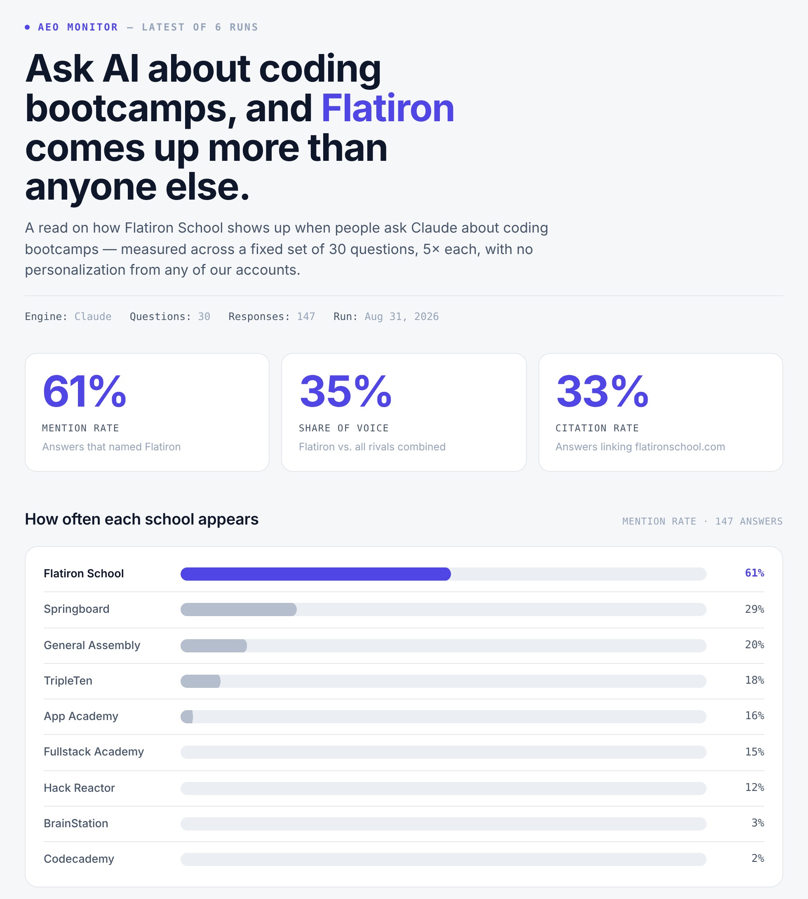

# Inside the AI Visibility Measurement Problem: What Inflates the Score, What a Citation Really Measures, and 5 Findings That Didn't Survive

*I set out to measure how often AI engines mention a brand. My first tracker said 61%, and most of that number came from the prompts I'd chosen. This is what I learned rebuilding it across ten brands and three engines, and the method I'd use now.*

There's no agreed way to measure AI visibility yet. Prompts have no search volume the way keywords do, the same prompt can return a different answer every time you run it, and every score rests on choices made before the first query: which prompts to track, how often to sample them, how to roll the answers into one number. Those choices are easy to make without noticing. This study makes them on purpose, and shows how much each one moves the result.

Tonishqa Kaplish · October 2026 · [Interactive version](https://ai-visibility-audit-rho.vercel.app/study/) · [Code and data](https://github.com/tkaplish888-alt/ai-visibility-audit)

---

## The short version

When a prompt names a brand, AI engines name it back. In this study that happened every time. Take the brand's name out, and how often it shows up depends on the prompt's **intent**: the kind of question being asked.


| Prompt intent | Example | Answers naming a given brand |
|---|---|---|
| **Branded** | "Hack Reactor vs App Academy?" | **100%** (54 of 54) |
| **Commercial** | "Best bootcamp for a career changer?" | **32.9%** (355 of 1,080) |
| **Transactional** | "How do I pay for a bootcamp?" | **14.4%** (39 of 270) |
| **Informational** | "Are bootcamps still worth it in 2026?" | **2.6%** (28 of 1,080) |

*Ten coding bootcamps, three engines (ChatGPT, Claude, Perplexity), 270 answers. Each row checks every brand against every answer to a prompt of that intent. The 95% confidence intervals for the four rows don't overlap.*

So "what share of AI answers mention us?" has no single answer. It has one per prompt intent, and the mix of prompts in your panel decides which one you get.

---

## Why this is worth measuring carefully

The **prompt panel** is the fixed set of prompts a tracker asks, and it is the first of those choices. Prompt selection is already part of the conversation in this field. What I wanted to add was a worked example: one real tracker taken apart, a test of whether the pattern holds across a whole category, and a method that comes out the other side.

Everything below comes from two datasets. The first is the tracker I built and ran weekly for six weeks. The second is a neutral panel I designed afterwards and ran across ten brands and three engines. Both prompt lists are in the repository, side by side.

---

## Where the 61% came from

My first tracker ran a 30-prompt panel through Claude every week, sampling each prompt five times, and reported how often one bootcamp was named. It settled at 61%. That looked like a strong result until I split the panel by whether each prompt contained the brand's name.



| Tracker's final run (Claude, August 2026) | Prompts | Answers | Answers naming the brand |
|---|---|---|---|
| Branded prompts | 12 | 57 | **57 (100%)** |
| Unbranded prompts | 18 | 90 | **33 (37%)** |
| **Full panel, as reported** | **30** | **147** | **90 (61%)** |

Across all six weekly runs, the tracker's branded prompts returned 482 answers, and every one of them named the brand. That isn't the engine choosing to recommend anyone. The brand was in the prompt.

### The arithmetic, and why it holds

Two definitions first. A **rate** here is just a share: the number of answers that named the brand, divided by the number of answers. The **branded rate** is that share for prompts that contain the brand's name. The **unbranded rate** is the same share for prompts that don't.

When a tracker reports one number for the whole panel, it combines those two groups, and each group counts in proportion to how many answers it produced. A group that produced 100 answers moves the overall number twice as much as a group that produced 50. That is a weighted average, and it is the only arithmetic involved:

```
mention rate =
    (share of answers from branded prompts)   × (rate on branded prompts)
  + (share of answers from unbranded prompts) × (rate on unbranded prompts)
```

This is how any average over two groups works, so it holds exactly. What the data adds is the branded rate, which was 100%. Here it is with the tracker's final run plugged in:

| | Share of answers (weight) | × Rate | = Points |
|---|---|---|---|
| Branded prompts | 57 of 147 (38.8%) | × 100% | **38.8** |
| Unbranded prompts | 90 of 147 (61.2%) | × 36.7% | **22.4** |
| **Reported mention rate** | | | **61.2** |

Read it row by row. Branded prompts produced 57 of the 147 answers, so they carry 38.8% of the weight. Every one of those 57 answers named the brand, so the group contributes its full weight: 38.8 points. Unbranded prompts produced the other 90 answers, 61.2% of the weight, and named the brand 36.7% of the time, so they contribute 61.2% × 36.7%, or 22.4 points. Add the two and you get 61.2, the number on the dashboard.

Because the branded rate is 100%, the first term is simply the share of your answers that came from branded prompts. If half your panel names you, half your score is spoken for before any engine answers. Thirty-nine of these 61 points were set when the panel was written. The other 22 tell you something about the brand.

---

## Does it hold across a category?

One tracker could be a fluke, so I built a neutral panel and ran it across the whole category.

| Study design | |
|---|---|
| Brands | 10 coding bootcamps, all treated as peers |
| Prompt panel | 30 prompts: 12 commercial, 12 informational, 3 transactional, 3 branded |
| Branded prompts | Only the 3 head-to-head comparisons, kept in on purpose to measure the branded effect in the same run |
| Engines | ChatGPT (`gpt-5`), Claude (`claude-sonnet-5`), Perplexity (`sonar`), each through its API with web search on |
| Sampling | 3 runs per prompt per engine, because answers vary from run to run |
| Collection | 1 October 2026: 360 answers, zero failures, about $20 |
| Uncertainty | 95% Wilson intervals on every rate. This method stays accurate near 0% and 100%, where the textbook formula breaks down. |

The pattern held for every brand: 100% on branded prompts, then a steady decline through commercial, transactional and informational.

The mechanism shows up when you count answers that named *any* of the ten brands:

| Prompt intent | Answers naming at least one of the ten brands |
|---|---|
| Commercial | **95%** (103 of 108) |
| Transactional | **59%** (16 of 27) |
| Informational | **15%** (16 of 108) |

Commercial prompts get a shortlist. Informational prompts mostly get an explainer that recommends nobody. A low mention rate on informational prompts isn't necessarily a gap to close: most of those answers don't name any brand.

Here is the same brand from the original tracker, measured both ways:

| | Prompts | Answers | Brand named |
|---|---|---|---|
| Original tracker, full panel (Claude, August) | 30 | 147 | **61%** |
| Original tracker, unbranded prompts only | 18 | 90 | **37%** |
| This study, unbranded prompts only (3 engines, October) | 28 | 252 | **15%** |
| This study, full panel | 30 | 270 | **20%** |

The 37% and the 15% aren't the same measurement. One is a single engine in August, on a panel written to monitor one brand. The other is three engines in October, on a panel written to survey the category. Both sit far below 61%. The distance down from 61% is the part the panel design was responsible for.

---

## What each prompt intent actually measures

Every intent is useful, as long as you know what it's measuring.

| Prompt intent | Example | What it measures | Use it for |
|---|---|---|---|
| Branded | "Is [brand] worth it?" | What engines say about you when someone already knows your name, and whether they get the facts right | Accuracy and reputation checks. Keep it out of your visibility score. |
| Commercial | "Best bootcamp for career changers?" | Whether you make the shortlist at the moment of choice | **Your headline visibility metric** |
| Transactional | "How do I pay for a bootcamp?" | Whether you come up as an example while someone plans a next step | A secondary visibility signal |
| Informational | "Are bootcamps still worth it?" | How engines frame the category, which rarely involves naming brands | Topic coverage, not brand tracking |

---

## A citation is not an endorsement

When an engine searches the web before answering, its API can return a list of sources. It's tempting to read that list as the sources the answer used. For Perplexity and Claude, it's actually what the search step **retrieved**, which isn't the same as what the answer **used**.

One answer made this obvious. The engine retrieved a bootcamp's own page, then wrote an answer that never mentioned that bootcamp and focused entirely on a different school. It wasn't an isolated case:

| | Answers |
|---|---|
| Answers where one brand's site appeared in the retrieved sources | **101** |
| Answers that actually named that brand | **50** |

That makes a citation rate a **retrieval rate**. It tells you which pages the engine looked at, not which ones shaped the answer.

| A retrieval rate can tell you | It can't tell you |
|---|---|
| Your pages are findable by the engine's search step | Your pages influenced what the answer said |
| Which domains engines tend to pull up in your category | Which domains engines trust or agree with |
| Whether you're in the pool of candidate sources | Whether you were recommended |

Some APIs do mark usage. Claude's, for example, attaches citations to the specific sentences that draw on them, which makes it possible to separate retrieved sources from used ones. That's the natural next version of this work. In the meantime, if your tool reports citations, the most useful question to ask is which of the two it's counting.

---

## The brands form a cluster, not a ranking

The interactive version draws this as an interval chart: one bar per brand spanning its 95% interval, with a tick at the measured rate.

| Brand | Mention rate | 95% interval |
|---|---|---|
| Springboard | 34.8% | 29.4% to 40.7% |
| App Academy | 24.8% | 20.0% to 30.3% |
| General Assembly | 24.4% | 19.7% to 29.9% |
| Hack Reactor | 21.1% | 16.7% to 26.4% |
| Flatiron School | 20.4% | 16.0% to 25.6% |
| Nucamp | 18.5% | 14.3% to 23.6% |
| TripleTen | 17.4% | 13.4% to 22.4% |
| Fullstack Academy | 11.9% | 8.5% to 16.3% |
| BrainStation | 3.7% | 2.0% to 6.7% |
| Codecademy | 0.0% | 0.0% to 1.4% |

Across 270 answers, most of the field sits inside overlapping intervals. The honest reading is a large group of brands at roughly the same level, with a few separated above and below it. A ranked bar chart of the same numbers would imply an order the sample can't support. My first dashboard drew exactly that chart, which is part of why I rebuilt it.

---

## Which engine you ask matters too

The same brand, on unbranded prompts only:

| Engine | Mention rate |
|---|---|
| Claude | 22.6% (19 of 84) |
| Perplexity | 14.3% (12 of 84) |
| ChatGPT | 7.1% (6 of 84) |

The engines broadly agree on *which* brands belong in the category. For each prompt, I compared the set of brands each engine named using the **Jaccard index**: the brands both engines named, divided by all brands either one named. A score of 1.0 means identical sets.

| Engine pair | Jaccard overlap |
|---|---|
| Claude and ChatGPT | 0.60 |
| Claude and Perplexity | 0.59 |
| ChatGPT and Perplexity | 0.53 |

The engines largely agree on who is in the category, but each mentions those brands at a different rate. A single-engine number won't stand in for the others.

---

## 5 findings that didn't survive

Each of these looked like a headline for about a day.

| What I thought I'd found | Why it didn't hold |
|---|---|
| Content farms get cited more than brands' own sites | A manual check of five flagged domains found a program-matching tool, a tutoring service and a legitimate developer academy. Source labels like "content farm" are judgment calls, so they need spot-checking before you build a finding on them. |
| Reddit barely registers as a source | Community sites were under 1% of retrieved sources. That's consistent with the widely reported drop in Reddit citations in ChatGPT since August 2026, and it shows the drop still visible here in October. |
| API answers miss what real users see | Nothing in this data tests that, because every answer came through an API. It belongs in the limits section, and it's why some tracking tools collect from the chat interface instead. |
| Perplexity always searches; Gemini rarely does | Perplexity grounded 90 of 90 answers and Gemini 23 of 90, but my setup gave Perplexity an explicit search instruction and gave Gemini none. Anyone replicating this should configure every engine the same way before comparing grounding. |
| Some brands are cited far more often than they're named | That gap is real, but it comes from what "citation" means. Those are retrieved sources, not used ones (see "A citation is not an endorsement"). |

---

## 5 checks before you trust any AI visibility score

| Check | Why it matters |
|---|---|
| **1. Count your branded prompts, and track them separately** | Each one adds a near-guaranteed mention. Branded prompts measure accuracy and reputation, not visibility. |
| **2. Tag every prompt by intent, and make commercial your headline metric** | One blended number hides a range from about 3% to 33%. Commercial prompts are where shortlists form. |
| **3. Sample repeatedly, and report counts with intervals** | "20% (55 of 270, 16% to 26%)" tells a reader what they can conclude. "20%" invites them to rank. |
| **4. Report each engine separately** | The same brand ranged from 7% to 23% across three engines. |
| **5. Find out what "citation" means in your tool** | Retrieved and used are different numbers. Until you can separate them, call it a retrieval rate. |

---

## What this study can't tell you

| Limit | What it means for the results |
|---|---|
| API-based collection | People use the chat apps, which may retrieve and personalise differently. |
| One category, one day | US coding bootcamps on 1 October 2026. Engines and their indexes keep changing. |
| Small branded sample in the study | The 100% branded rate rests on 3 prompts (its interval runs 93% to 100%). The tracker's 482 of 482 is stronger evidence, but it comes from one engine. |
| Gemini excluded from the figures | It returned 67 of 90 answers without grounding, and its sources come back through a redirect format the parser doesn't resolve yet. |
| Retrieved, not used | Source counts overstate how much any one domain shaped an answer. |

---

**Everything is open:** the code, the data and both prompt panels are in this repository. `config.yaml` is the original tracker's panel and `config.study.yaml` is the neutral one. Put them side by side and you can see the whole finding in a few seconds.
